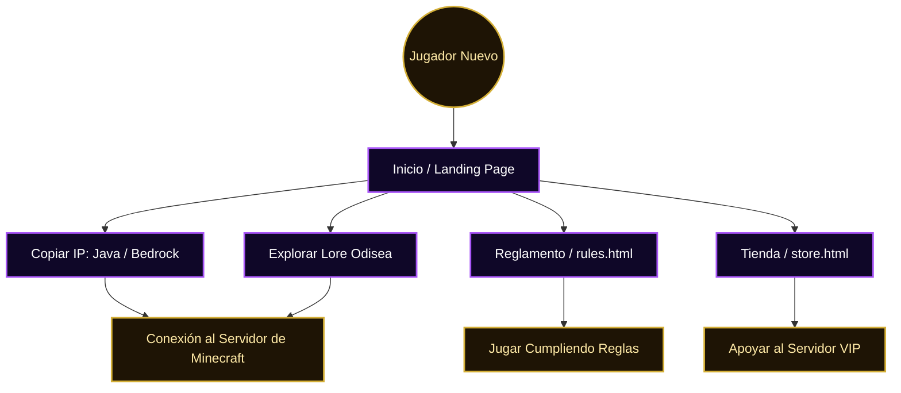

# DrakesCraft — Sitio Web Oficial

<p align="center">
  
</p>

Sitio web oficial y portal de comunidad para **DrakesCraft**, un servidor de Minecraft Survival de alta gama con temática de **Odisea Cósmica**, integración profunda de **Slimefun** y soporte multiplataforma completo (Java y Bedrock).

---

## 🌌 Características de DrakesCraft

DrakesCraft no es un servidor Survival ordinario; ofrece una experiencia RPG y técnica avanzada que incluye:

*   **Lore de la Odisea Cósmica:** Una narrativa inmersiva donde los jugadores exploran mundos, facciones galácticas y misterios ancestrales.
*   **Integración de Slimefun 4:** Convierte tu partida de Minecraft en una experiencia tecnológica industrial similar a mods (mecanismos, reactores, magia y aleaciones), todo sin instalar nada en tu cliente.
*   **Crossplay Absoluto:** Conexión simultánea y optimizada tanto para jugadores de Java Edition (PC) como Bedrock Edition (Consolas, Móviles y Windows 10/11).
*   **Economía Balanceada y Tienda:** Sistema de comercio justo, reclamos de terrenos (`claims`) y rangos cosméticos de apoyo.

---

## 🗺️ Mapa de Navegación del Usuario

A continuación se detalla el flujo de navegación que experimenta un usuario al ingresar a la plataforma web de DrakesCraft:



---

## 📂 Contenido del Repositorio

El sitio web está construido bajo estándares web modernos y limpios usando HTML5 y CSS3 nativo (Vanilla CSS), asegurando una carga ultra rápida y excelente SEO:

| Archivo / Carpeta | Descripción |
| :--- | :--- |
| [index.html](file:///C:/Users/pablo/Documentos/GitHub/drakescraft-web/index.html) | Página principal con lore, características, FAQ de conexión y acordeones interactivos. |
| [rules.html](file:///C:/Users/pablo/Documentos/GitHub/drakescraft-web/rules.html) | Reglamento oficial de conducta, reglas de convivencia del servidor y términos. |
| [store.html](file:///C:/Users/pablo/Documentos/GitHub/drakescraft-web/store.html) | Catálogo de rangos VIP, llaves de cofres y métodos de donación soportados. |
| [styles.css](file:///C:/Users/pablo/Documentos/GitHub/drakescraft-web/styles.css) | Hoja de estilos unificada con paleta de color oscura, morada y dorada. |
| [script.js](file:///C:/Users/pablo/Documentos/GitHub/drakescraft-web/script.js) | Lógica interactiva: copiado automático de IP al portapapeles, filtros de tienda y FAQ. |
| [assets/](file:///C:/Users/pablo/Documentos/GitHub/drakescraft-web/assets/) | Logotipos y recursos vectoriales interactivos (`hero.svg`). |

---

## 💻 Desarrollo y Vista Local

El sitio es estático, por lo que no requiere ningún proceso de compilación previo. Puedes visualizarlo directamente abriendo el archivo `index.html` en tu navegador, o sirviéndolo localmente para probar comportamientos asíncronos y copiado:

```bash
# Servir usando Node.js (serve)
npx --yes serve .
```

---

## 👥 Comunidad y Enlaces

*   **Sitio Oficial:** [https://drakescraft.cl](https://drakescraft.cl)
*   **Servidor de Discord:** [discord.gg/rR7FbfCt9Y](https://discord.gg/rR7FbfCt9Y)

---

*Minecraft es una marca registrada de Mojang Synergies AB. Este sitio y servidor no están afiliados ni avalados por Mojang.*
